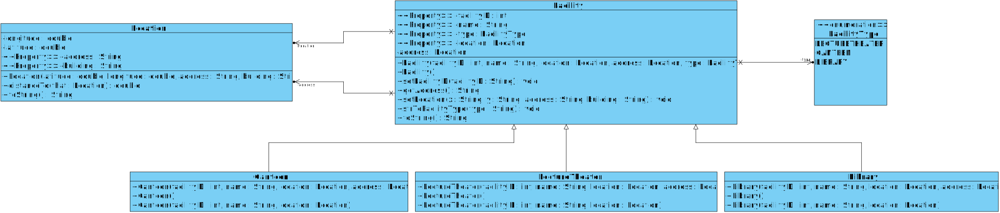
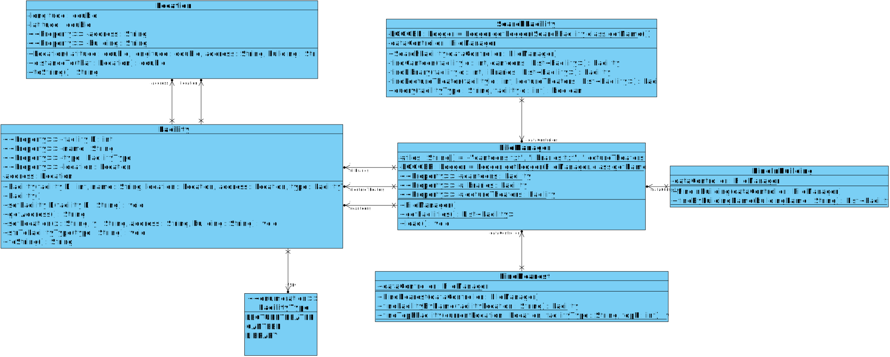
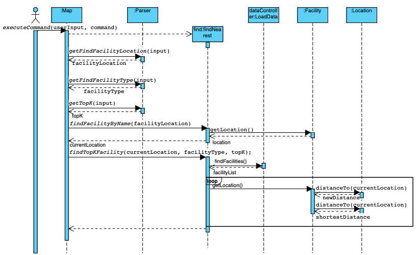
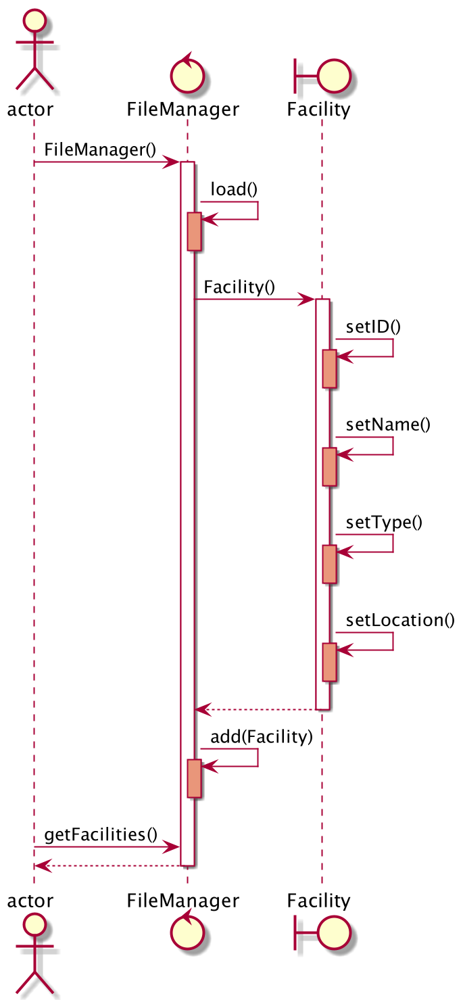
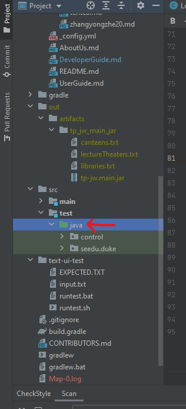

# Developer Guide

## Table of Contents
1. [Design and implementation](#design-&-implementation)\
   1.1. [Class Diagram](#class-diagram-for-v20)\
   1.2. [Sequence Diagram](#sequence-diagram-for-v20)\
    1.2.1. [List all Locations](#sequence-diagram-for-listalllocations)\
    1.2.2. [Find Nearest Facility](#sequence-diagram-for-findnearest)\
    1.2.3. [Load Facility Data](#sequence-diagram-for-loading-facility-data)
2. [Product scope](#product-scope)\
   2.1. [Target user profile](#target-user-profile)\
   2.2. [Value proposition](#value-proposition)
3. [User Stories](#user-stories)\
   3.1. [Functional Requirements](#functional-requirements)\
   3.2. [Non-Functional Requirements](#non-functional-requirements)
4. [Miscellaneous](#miscellaneous)\
  4.1. [Instructions for automated testing](#instructions-for-automated-testing)\
  4.2. [Instructions for manual testing](#instructions-for-manual-testing)\
  4.3. [Instructions for logging](#instructions-for-logging)\
  4.4. [Instructions for building jar](#instructions-for-building-jar)

## Design & implementation

### Class diagram for v2.0
#### Class diagram for Entity classes:

The class diagram shows clearly that each facility has one or more locations. Canteen, LectureTheater and Library inherit from Facility.

#### Class diagram for Control classes:

Each facility has one or more locations.  All control classes, namely SeachFacility, FindNearest,FindInBuilding has an instance called dataController of FileManager to get information from the database on various facilities.

### Sequence diagram for v2.0
#### Sequence diagram for listAllLocations

#### Sequence diagram for findNearest

#### Sequence diagram for loading facility data

## Product scope
### Target user profile
Students who wish to navigate to a certain place in campus and prefer typing quickly.

### Value proposition
- Help freshmen to be familiar with campus
- Find lecture theatres/canteens/libraries

## User Stories

### Functional Requirements

1. Find nearby libraries `[must-have]`
   
* As a user, I can input the current location (with respect to another nearest facility) to find the nearest libraries\
To get to the nearest libraries.

2. Find nearby canteens `[must-have]`

* As a user, I can input the current location (with respect to another nearest facility) to find the nearest canteens\
To get to the nearest canteen from the user’s location.

3. Find nearby lecture theatres `[must-have]`

* As a user, I can input the current location (with respect to another nearest facility) to find the nearest lecture theatres\
  To get to the nearest lecture theatres from the user’s location.

4. View all facility categories `[must-have]`

* As a user, I can view the list of categories of facilities in the school.\
So that user will know the type of facilities provided in the school and be able to use the program accordingly.
  
5. View all lecture theatres in the school `[nice-to-have]`
* As a user, I can view the list of all lecture theatres in the school.

6. View all canteens in the school `[nice-to-have]`
* As a user , I can view the list of all canteens in the school.
Get a better overview of what food there is in school

7. View all libraries in the school `[nice-to-have]`
* As a user, I can view the list of all libraries in the school
To know all the available libraries  in the school.

8. View the location of a specific lecture theater in school `[nice-to-have]`
* As a user, I can view the location of a specific lecture theater in school
To know where a lecture theater is if a user knows its ID.

9. View the location of a specific canteen in school `[nice-to-have]`
* As a user, I can view the list of all canteens in the school.
To know where a canteen is if a user knows its ID.

10. View the location of a specific library in school `[nice-to-have]`
* As a user, I can view the list of all canteens in the school.
To know where a library is if a user knows its ID.

### Non-Functional Requirements

1. The program must return results for any command within 5 seconds upon first input by a fast-typer.
2. The program must be able to run on a desktop / laptop that can run Java 11.
3. The program must be able to return the nearest facility from a fast-typer within one minute upon program launch.

## Miscellaneous

### Instructions for automated testing
1. On IntelliJ, make sure the `src/test/java` folder is marked as a `Test Sources Root`.\
   It should look like below after that.\

2. Right click on that folder, then click on `Run 'Tests in <package>'`
3. Get the test results in the bottom panel of the IDE.

### Instructions for manual testing
1. Test data parser
* find the `loadDataTest` in path `tp/src/test/java/seedu/duke/loadDataTest.java`.
* run dataLoadTest.
* if the text file are empty, the test will fail. 

### Instructions for logging
The following data are logged:
1. User Inputs
2. All error handling messages

### Instructions for building jar
run the `shadowJar` in `build.gradle` script. And the output jar will be stored in `build\libs`.
